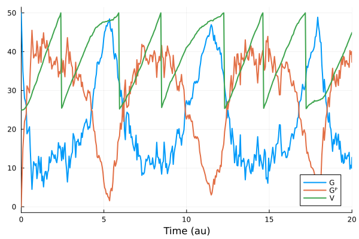

# Catalyst.jl

[-blue.svg)](https://docs.sciml.ai/Catalyst/stable/)
[-blue.svg)](https://docs.sciml.ai/Catalyst/stable/api/)
[-blue.svg)](https://docs.sciml.ai/Catalyst/dev/)
[-blue.svg)](https://docs.sciml.ai/Catalyst/dev/api/)
<!--[](https://julialang.zulipchat.com/#narrow/stream/279055-sciml-bridged)-->

[](https://github.com/SciML/Catalyst.jl/actions?query=workflow%3ACI)
[](https://codecov.io/gh/SciML/Catalyst.jl)
[](https://coveralls.io/github/SciML/Catalyst.jl?branch=master)

[](https://github.com/SciML/ColPrac)
[](https://github.com/SciML/SciMLStyle)
[](https://journals.plos.org/ploscompbiol/article?id=10.1371/journal.pcbi.1011530)

Catalyst.jl is a symbolic modeling package for analysis and high-performance
simulation of chemical reaction networks. Catalyst defines symbolic
[`ReactionSystem`](https://docs.sciml.ai/Catalyst/stable/catalyst_functionality/programmatic_CRN_construction/)s,
which can be created programmatically or easily
specified using Catalyst's domain-specific language (DSL). Leveraging
[ModelingToolkit.jl](https://github.com/SciML/ModelingToolkit.jl) and
[Symbolics.jl](https://github.com/JuliaSymbolics/Symbolics.jl), Catalyst enables
large-scale simulations through auto-vectorization and parallelism. Symbolic
`ReactionSystem`s can be used to generate ModelingToolkit-based models, allowing
the easy simulation and parameter estimation of mass action ODE models, Chemical
Langevin SDE models, stochastic chemical kinetics jump process models, and more.
Generated models can be used with solvers throughout the broader Julia and
[SciML](https://sciml.ai) ecosystems, including higher-level SciML packages (e.g.
for sensitivity analysis, parameter estimation, machine learning applications,
etc).

## Breaking changes and new features

**NOTE:** Version 14 is a breaking release, prompted by the release of ModelingToolkit.jl version 9. This caused several breaking changes in how Catalyst models are represented and interfaced with.

Breaking changes and new functionality are summarized in the [HISTORY.md](HISTORY.md) file. Furthermore, a migration guide on how to adapt your workflows to the new v14 update can be found [here](https://docs.sciml.ai/Catalyst/stable/v14_migration_guide/).

## Tutorials and documentation

The latest tutorials and information on using Catalyst are available in the [stable
documentation](https://docs.sciml.ai/Catalyst/stable/). The [in-development
documentation](https://docs.sciml.ai/Catalyst/dev/) describes unreleased features in
the current master branch.

An overview of the package, its features, and comparative benchmarking (as of version 13) can also
be found in its corresponding research paper, [Catalyst: Fast and flexible modeling of reaction networks](https://journals.plos.org/ploscompbiol/article?id=10.1371/journal.pcbi.1011530).

## Features

#### Features of Catalyst
- [The Catalyst DSL](https://docs.sciml.ai/Catalyst/stable/model_creation/dsl_basics/) provides a simple and readable format for manually specifying reaction network models using chemical reaction notation.
- Catalyst `ReactionSystem`s provides a symbolic representation of reaction networks, built on [ModelingToolkit.jl](https://docs.sciml.ai/ModelingToolkit/stable/) and [Symbolics.jl](https://docs.sciml.ai/Symbolics/stable/).
- The [Catalyst.jl API](http://docs.sciml.ai/Catalyst/stable/api/catalyst_api) provides functionality for building networks programmatically and for composing multiple networks together.
- Leveraging ModelingToolkit, generated models can be converted to symbolic reaction rate equation ODE models, symbolic Chemical Langevin Equation models, and symbolic stochastic chemical kinetics (jump process) models. These can be simulated using any [DifferentialEquations.jl](https://docs.sciml.ai/DiffEqDocs/stable/) [ODE/SDE/jump solver](https://docs.sciml.ai/Catalyst/stable/model_simulation/simulation_introduction/), and can be used within `EnsembleProblem`s for carrying out [parallelized parameter sweeps and statistical sampling](https://docs.sciml.ai/Catalyst/stable/model_simulation/ensemble_simulations/). Plot recipes are available for [visualization of all solutions](https://docs.sciml.ai/Catalyst/stable/model_simulation/simulation_plotting/).
- Non-integer (e.g. `Float64`) stoichiometric coefficients [are supported](https://docs.sciml.ai/Catalyst/stable/model_creation/dsl_basics/#dsl_description_stoichiometries_decimal) for generating ODE models, and symbolic expressions for stoichiometric coefficients [are supported](https://docs.sciml.ai/Catalyst/stable/model_creation/parametric_stoichiometry/) for all system types.
- A [network analysis suite](https://docs.sciml.ai/Catalyst/stable/model_creation/network_analysis/) permits the computation of linkage classes, deficiencies, reversibility, and other network properties.
- [Conservation laws can be detected and utilized](https://docs.sciml.ai/Catalyst/stable/model_creation/conservation_laws/) to reduce system sizes, and to generate non-singular Jacobians (e.g. during conversion to ODEs, SDEs, and steady state equations).
- Catalyst reaction network models can be [coupled with differential and algebraic equations](https://docs.sciml.ai/Catalyst/stable/model_creation/constraint_equations/) (which are then incorporated during conversion to ODEs, SDEs, and steady state equations).
- Models can be [coupled with events](https://docs.sciml.ai/Catalyst/stable/model_creation/constraint_equations/#constraint_equations_events) that affect the system and its state during simulations.
- By leveraging ModelingToolkit, users have a variety of options for generating optimized system representations to use in solvers. These include construction of [dense or sparse Jacobians](https://docs.sciml.ai/Catalyst/stable/model_simulation/ode_simulation_performance/#ode_simulation_performance_sparse_jacobian), [multithreading or parallelization of generated derivative functions](https://docs.sciml.ai/Catalyst/stable/model_simulation/ode_simulation_performance/#ode_simulation_performance_parallelisation), [automatic classification of reactions into optimized jump types for Gillespie type simulations](https://docs.sciml.ai/JumpProcesses/stable/jump_types/#jump_types), [automatic construction of dependency graphs for jump systems](https://docs.sciml.ai/JumpProcesses/stable/jump_types/#Jump-Aggregators-Requiring-Dependency-Graphs), and more.
- [Symbolics.jl](https://github.com/JuliaSymbolics/Symbolics.jl) symbolic expressions and Julia `Expr`s can be obtained for all rate laws and functions determining the deterministic and stochastic terms within resulting ODE, SDE, or jump models.
- [Steady states](https://docs.sciml.ai/Catalyst/stable/steady_state_functionality/homotopy_continuation/) (and their [stabilities](https://docs.sciml.ai/Catalyst/stable/steady_state_functionality/steady_state_stability_computation/)) can be computed for model ODE representations.

#### Features of Catalyst composing with other packages
- [OrdinaryDiffEq.jl](https://github.com/SciML/OrdinaryDiffEq.jl) Can be used to numerically solver generated reaction rate equation ODE models.
- [StochasticDiffEq.jl](https://github.com/SciML/StochasticDiffEq.jl) can be used to numerically solve generated Chemical Langevin Equation SDE models.
- [JumpProcesses.jl](https://github.com/SciML/JumpProcesses.jl) can be used to numerically sample generated Stochastic Chemical Kinetics Jump Process models.
- Support for [parallelization of all simulations](https://docs.sciml.ai/Catalyst/stable/model_simulation/ode_simulation_performance/#ode_simulation_performance_parallelisation), including parallelization of [ODE simulations on GPUs](https://docs.sciml.ai/Catalyst/stable/model_simulation/ode_simulation_performance/#ode_simulation_performance_parallelisation_GPU) using [DiffEqGPU.jl](https://github.com/SciML/DiffEqGPU.jl).
- [Latexify](https://korsbo.github.io/Latexify.jl/stable/) can be used to [generate LaTeX expressions](https://docs.sciml.ai/Catalyst/stable/model_creation/model_visualisation/#visualisation_latex) corresponding to generated mathematical models or the underlying set of reactions.
- [Graphviz](https://graphviz.org/) can be used to generate and [visualize reaction network graphs](https://docs.sciml.ai/Catalyst/stable/model_creation/model_visualisation/#visualisation_graphs) (reusing the Graphviz interface created in [Catlab.jl](https://algebraicjulia.github.io/Catlab.jl/stable/)).
- Model steady states can be [computed through homotopy continuation](https://docs.sciml.ai/Catalyst/stable/steady_state_functionality/homotopy_continuation/) using [HomotopyContinuation.jl](https://github.com/JuliaHomotopyContinuation/HomotopyContinuation.jl) (which can find *all* steady states of systems with multiple ones), by [forward ODE simulations](https://docs.sciml.ai/Catalyst/stable/steady_state_functionality/nonlinear_solve/#steady_state_solving_simulation) using [SteadyStateDiffEq.jl](https://github.com/SciML/SteadyStateDiffEq.jl), or by [numerically solving steady-state nonlinear equations](https://docs.sciml.ai/Catalyst/stable/steady_state_functionality/nonlinear_solve/#steady_state_solving_nonlinear) using [NonlinearSolve.jl](https://github.com/SciML/NonlinearSolve.jl).
- [BifurcationKit.jl](https://github.com/bifurcationkit/BifurcationKit.jl) can be used to [compute bifurcation diagrams](https://docs.sciml.ai/Catalyst/stable/steady_state_functionality/bifurcation_diagrams/) of model steady states (including finding periodic orbits).
- [DynamicalSystems.jl](https://github.com/JuliaDynamics/DynamicalSystems.jl) can be used to compute model [basins of attraction](https://docs.sciml.ai/Catalyst/stable/steady_state_functionality/dynamical_systems/#dynamical_systems_basins_of_attraction), [Lyapunov spectrums](https://docs.sciml.ai/Catalyst/stable/steady_state_functionality/dynamical_systems/#dynamical_systems_lyapunov_exponents), and other dynamical system properties.
- [StructuralIdentifiability.jl](https://github.com/SciML/StructuralIdentifiability.jl) can be used to [perform structural identifiability analysis](https://docs.sciml.ai/Catalyst/stable/inverse_problems/structural_identifiability/).
- [Optimization.jl](https://github.com/SciML/Optimization.jl), [DiffEqParamEstim.jl](https://github.com/SciML/DiffEqParamEstim.jl), and [PEtab.jl](https://github.com/sebapersson/PEtab.jl) can all be used to [fit model parameters to data](https://sebapersson.github.io/PEtab.jl/stable/Define_in_julia/).
- [GlobalSensitivity.jl](https://github.com/SciML/GlobalSensitivity.jl) can be used to perform [global sensitivity analysis](https://docs.sciml.ai/Catalyst/stable/inverse_problems/global_sensitivity_analysis/) of model behaviors.
- [SciMLSensitivity.jl](https://github.com/SciML/SciMLSensitivity.jl) can be used to compute local sensitivities of functions containing forward model simulations.

#### Features of packages built upon Catalyst
- Catalyst [`ReactionSystem`](@ref)s can be [imported from SBML files](https://docs.sciml.ai/Catalyst/stable/model_creation/model_file_loading_and_export/#Loading-SBML-files-using-SBMLImporter.jl-and-SBMLToolkit.jl) via [SBMLImporter.jl](https://github.com/sebapersson/SBMLImporter.jl) and [SBMLToolkit.jl](https://github.com/SciML/SBMLToolkit.jl), and [from BioNetGen .net files](https://docs.sciml.ai/Catalyst/stable/model_creation/model_file_loading_and_export/#file_loading_rni_net) and various stoichiometric matrix network representations using [ReactionNetworkImporters.jl](https://github.com/SciML/ReactionNetworkImporters.jl).
- [MomentClosure.jl](https://github.com/augustinas1/MomentClosure.jl) allows generation of symbolic ModelingToolkit `ODESystem`s that represent moment closure approximations to moments of the Chemical Master Equation, from reaction networks defined in Catalyst.
- [FiniteStateProjection.jl](https://github.com/kaandocal/FiniteStateProjection.jl) allows the construction and numerical solution of Chemical Master Equation models from reaction networks defined in Catalyst.
- [DelaySSAToolkit.jl](https://github.com/palmtree2013/DelaySSAToolkit.jl) can augment Catalyst reaction network models with delays, and can simulate the resulting stochastic chemical kinetics with delays models.


## Illustrative example

#### Deterministic ODE simulation of Michaelis-Menten enzyme kinetics
Here we show a simple example where a model is created using the Catalyst DSL, and then simulated as
an ordinary differential equation.

```julia
# Fetch required packages.
using Catalyst, OrdinaryDiffEq, Plots

# Create model.
model = @reaction_network begin
    kB, S + E --> SE
    kD, SE --> S + E
    kP, SE --> P + E
end

# Create an ODE that can be simulated.
u0 = [:S => 50.0, :E => 10.0, :SE => 0.0, :P => 0.0]
tspan = (0., 200.)
ps = [:kB => 0.01, :kD => 0.1, :kP => 0.1]
ode = ODEProblem(model, u0, tspan, ps)

# Simulate ODE and plot results.
sol = solve(ode)
plot(sol; lw = 5)
```


#### Stochastic jump simulations
The same model can be used as input to other types of simulations. E.g. here we
instead generate and simulate a stochastic chemical kinetics jump process model
for the reaction network. An exact realization of the jump process is sampled
using an auto-selected stochastic simulation algorithm (SSA) (which for the
small network in the current example ends up being Gillespie's Direct method):
```julia
# The initial conditions are now integers as we track exact populations for each species.
using JumpProcesses
u0_integers = [:S => 50, :E => 10, :SE => 0, :P => 0]
dprob = DiscreteProblem(model, u0_integers, tspan, ps)
jprob = JumpProblem(model, dprob)
jump_sol = solve(jprob)
plot(jump_sol; lw = 2)
```


## More elaborate example
In the above example, we used basic Catalyst workflows to simulate a simple
model. Here we instead show how various Catalyst features can compose to create
a much more advanced model. Our model describes how the volume of a cell ($V$)
is affected by a growth factor ($G$). The growth factor only promotes growth
while in its phosphorylated form ($G^P$). The phosphorylation of $G$ ($G \to G^P$)
is promoted by sunlight (modeled as the cyclic sinusoid $k_a (\sin(t) + 1)$),
which phosphorylates the growth factor (producing $G^P$). When the cell reaches a
critical volume ($V_m$) it undergoes cell division. First, we declare our model:
```julia
using Catalyst
cell_model = @reaction_network begin
    @parameters Vₘ g
    @equations begin
        D(V) ~ g*Gᴾ
    end
    @continuous_events begin
        [V ~ Vₘ] => [V ~ V/2]
    end
    kₚ*(sin(t)+1)/V, G --> Gᴾ
    kᵢ/V, Gᴾ --> G
end
```
We now study the system as a Chemical Langevin Dynamics SDE model, which can be generated as follows
```julia
u0 = [:V => 25.0, :G => 50.0, :Gᴾ => 0.0]
tspan = (0.0, 20.0)
ps = [:Vₘ => 50.0, :g => 0.3, :kₚ => 100.0, :kᵢ => 60.0]
sprob = SDEProblem(cell_model, u0, tspan, ps)
```
This problem encodes the following stochastic differential equation model:
```math
\begin{align*}
dG(t) &=  - \left( \frac{k_p(\sin(t)+1)}{V(t)} G(t) + \frac{k_i}{V(t)} G^P(t) \right) dt - \sqrt{\frac{k_p (\sin(t)+1)}{V(t)} G(t)} \, dW_1(t) + \sqrt{\frac{k_i}{V(t)} G^P(t)} \, dW_2(t) \\
dG^P(t) &= \left( \frac{k_p(\sin(t)+1)}{V(t)} G(t) - \frac{k_i}{V(t)} G^P(t) \right) dt + \sqrt{\frac{k_p (\sin(t)+1)}{V(t)} G(t)} \, dW_1(t) - \sqrt{\frac{k_i}{V(t)} G^P(t)} \, dW_2(t) \\
dV(t) &= \left(g \, G^P(t)\right) dt
\end{align*}
```
where the $dW_1(t)$ and $dW_2(t)$ terms represent independent Brownian Motions, encoding the noise added by the Chemical Langevin Equation. Finally, we can simulate and plot the results.
```julia
using StochasticDiffEq, Plots
sol = solve(sprob, EM(); dt = 0.05)
plot(sol; xguide = "Time (au)", lw = 2)
```


Some features we used here:
- The cell volume was [modeled as a differential equation, which was coupled to the reaction network model](https://docs.sciml.ai/Catalyst/stable/model_creation/constraint_equations/#constraint_equations_coupling_constraints).
- The cell divisions were created by [incorporating events into the model](https://docs.sciml.ai/Catalyst/stable/model_creation/constraint_equations/#constraint_equations_events).
- We designated a specific numeric [solver and corresponding solver options](https://docs.sciml.ai/Catalyst/stable/model_simulation/simulation_introduction/#simulation_intro_solver_options).
- The model simulation was [plotted using Plots.jl](https://docs.sciml.ai/Catalyst/stable/model_simulation/simulation_plotting/).

## Getting help or getting involved
Catalyst developers are active on the [Julia Discourse](https://discourse.julialang.org/) and
the [Julia Slack](https://julialang.slack.com) channels \#sciml-bridged and \#sciml-sysbio.
For bugs or feature requests, [open an issue](https://github.com/SciML/Catalyst.jl/issues).

## Supporting and citing Catalyst.jl
The software in this ecosystem was developed as part of academic research. If you would like to help
support it, please star the repository as such metrics may help us secure funding in the future. If
you use Catalyst as part of your research, teaching, or other activities, we would be grateful if you
could cite our work:
```
@article{CatalystPLOSCompBio2023,
 doi = {10.1371/journal.pcbi.1011530},
 author = {Loman, Torkel E. AND Ma, Yingbo AND Ilin, Vasily AND Gowda, Shashi AND Korsbo, Niklas AND Yewale, Nikhil AND Rackauckas, Chris AND Isaacson, Samuel A.},
 journal = {PLOS Computational Biology},
 publisher = {Public Library of Science},
 title = {Catalyst: Fast and flexible modeling of reaction networks},
 year = {2023},
 month = {10},
 volume = {19},
 url = {https://doi.org/10.1371/journal.pcbi.1011530},
 pages = {1-19},
 number = {10},
}
```
