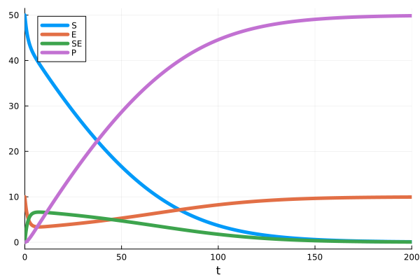
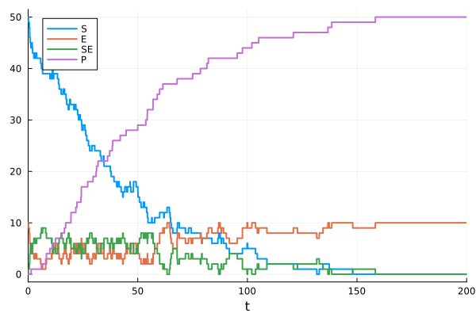
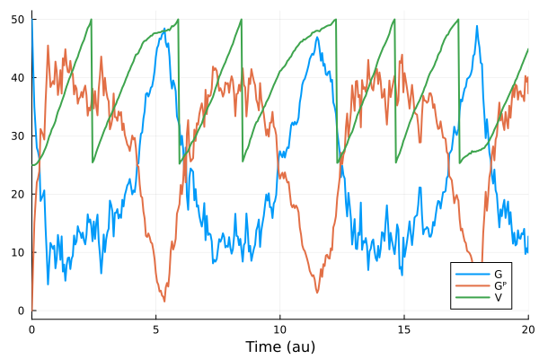

# Catalyst.jl

[-blue.svg)](https://docs.sciml.ai/Catalyst/stable/)
[-blue.svg)](https://docs.sciml.ai/Catalyst/dev/)
<!--[-blue.svg)](https://docs.sciml.ai/Catalyst/stable/api/)
[-blue.svg)](https://docs.sciml.ai/Catalyst/dev/api/)
[](https://julialang.zulipchat.com/#narrow/stream/279055-sciml-bridged)-->

[](https://github.com/SciML/Catalyst.jl/actions/workflows/Test.yml)
[](https://github.com/SciML/Catalyst.jl/actions/workflows/TestExtensions.yml)
<!--[](https://codecov.io/gh/SciML/Catalyst.jl)-->

[](https://github.com/SciML/ColPrac)
[](https://github.com/SciML/SciMLStyle)
[](https://journals.plos.org/ploscompbiol/article?id=10.1371/journal.pcbi.1011530)

Catalyst.jl is a symbolic modeling package for analysis and high-performance simulation of chemical reaction networks and related dynamical systems. Models can be specified using an intuitive [domain-specific language (DSL)](https://docs.sciml.ai/Catalyst/stable/model_creation/dsl_basics/) or constructed [programmatically](https://docs.sciml.ai/Catalyst/stable/model_creation/programmatic_CRN_construction/). Catalyst supports ODE, steady-state ODE, SDE, stochastic chemical kinetics (jump), and [hybrid](https://docs.sciml.ai/Catalyst/stable/model_simulation/simulation_introduction/) simulations, including models that couple reactions with differential equations, events, and external noise (via Brownian Motions and/or Poisson Processes).

Built on [ModelingToolkitBase.jl](https://github.com/SciML/ModelingToolkit.jl/tree/master/lib/ModelingToolkitBase) and [Symbolics.jl](https://github.com/JuliaSymbolics/Symbolics.jl), Catalyst leverages symbolic computation for sparsity exploitation, Jacobian construction, dependency graph analysis, and parallelism. Generated models integrate with the broader Julia and [SciML](https://sciml.ai) ecosystems for sensitivity analysis, parameter estimation, bifurcation analysis, and more.

## Installation
Catalyst can be installed as follows.
```julia
using Pkg

# (optional but recommended) create new environment in which to install Catalyst
Pkg.activate("catalyst_environment")

# install latest Catalyst release
Pkg.add("Catalyst")
```

## What's new in v16

**Version 16 is a breaking release.** Most breaking changes primarily affect libraries built on top of Catalyst. Please see [HISTORY.md](HISTORY.md) for the full list of breaking changes and migration guide.

Highlights:
- **ModelingToolkitBase foundation** — Without any reduction in core functionality, Catalyst now depends on [ModelingToolkitBase](https://github.com/SciML/ModelingToolkit.jl/tree/master/lib/ModelingToolkitBase) instead of ModelingToolkit, to avoid adding new, non-MIT licensed dependencies. 
- **ModelingToolkit compatible** - Catalyst is still compatible with ModelingToolkit for users who want to leverage more powerful, but non-MIT licensed, structural simplification libraries (e.g. for Catalyst-generated DAE models).
- **Hybrid models** — New `HybridProblem` and `hybrid_model` allow mixing ODE, SDE, and Jump reactions in a single system via per-reaction `PhysicalScale` metadata.
- **Simplified jump API** — Create jump problems directly with `JumpProblem(rs, u0, tspan, ps)`, with no `DiscreteProblem` or `JumpInputs` intermediate.
- **New DSL options** — `@brownians` and `@poissonians` for coupling environmental noise, `@discretes` for event-modified parameters, `@tstops` for solver time stops, and `=>` syntax for event affects.
- **Modernized conversion API** — `ode_model`, `sde_model`, `jump_model`, and `ss_ode_model` replace the old `convert(ODESystem, rs)` pattern, and all generate ModelingToolkitBase `System`s.
- **Unit validation** — `@unit_checks` DSL option and `validate_units`/`assert_valid_units` functions with full support for non-SI units via [DynamicQuantities.jl](https://github.com/SymbolicML/DynamicQuantities.jl) symbolic units.

## Tutorials and documentation

The latest tutorials and information on using Catalyst are available in the [stable documentation](https://docs.sciml.ai/Catalyst/stable/). The [in-development documentation](https://docs.sciml.ai/Catalyst/dev/) describes unreleased features in the current master branch.

An overview of the package, its features, and comparative benchmarking (as of version 13) can also be found in its corresponding research paper, [Catalyst: Fast and flexible modeling of reaction networks](https://journals.plos.org/ploscompbiol/article?id=10.1371/journal.pcbi.1011530).

## Features

- [**DSL for reaction networks**](https://docs.sciml.ai/Catalyst/stable/model_creation/dsl_basics/) — a readable, concise format for specifying models using chemical reaction notation.
- [**Multiple simulation types**](https://docs.sciml.ai/Catalyst/stable/model_simulation/simulation_introduction/) — generate and simulate ODE, steady-state ODE, SDE, jump, and hybrid models from a single `ReactionSystem`.
- [**Coupled models**](https://docs.sciml.ai/Catalyst/stable/model_creation/coupled_non_crn_models/) — combine reactions with differential equations, [events](https://docs.sciml.ai/Catalyst/stable/model_creation/events/), Brownian noise (`@brownians`), and Poisson jumps (`@poissonians`).
- [**Network analysis**](https://docs.sciml.ai/Catalyst/stable/network_analysis/crn_theory/) — compute linkage classes, deficiencies, reversibility, and other network properties.
- [**Compositional modeling**](https://docs.sciml.ai/Catalyst/stable/model_creation/compositional_modeling/) — build models hierarchically using `@network_component`, `compose`, and `extend`.
- [**Spatial modeling**](https://docs.sciml.ai/Catalyst/stable/spatial_modelling/discrete_space_reaction_systems/) — simulate reaction networks on discrete spatial domains.
- [**Steady state analysis**](https://docs.sciml.ai/Catalyst/stable/steady_state_functionality/homotopy_continuation/) — find and analyze steady states, stability, and bifurcation diagrams.
- [**Inverse problems**](https://docs.sciml.ai/Catalyst/stable/inverse_problems/optimization_ode_param_fitting/) — parameter estimation, sensitivity analysis, and structural identifiability.
- [**Model I/O**](https://docs.sciml.ai/Catalyst/stable/model_creation/model_file_loading_and_export/) — import from SBML and BioNetGen `.net` files, export to LaTeX and other formats.
- [**Visualization**](https://docs.sciml.ai/Catalyst/stable/model_creation/model_visualisation/) — reaction network graphs and LaTeX rendering.

## Quick examples

#### Deterministic ODE simulation of Michaelis-Menten enzyme kinetics
Here we show a simple example where a model is created using the Catalyst DSL, and then simulated as
an ordinary differential equation.

```julia
# Fetch required packages.
using Catalyst, OrdinaryDiffEqDefault, Plots

# Create model.
model = @reaction_network begin
    kB, S + E --> SE
    kD, SE --> S + E
    kP, SE --> P + E
end

# Create an ODE that can be simulated.
u0 = [:S => 50.0, :E => 10.0, :SE => 0.0, :P => 0.0]
tspan = (0., 200.)
ps = [:kB => 0.01, :kD => 0.1, :kP => 0.1]
ode = ODEProblem(model, u0, tspan, ps)

# Simulate ODE and plot results.
sol = solve(ode)
plot(sol; lw = 5)
```


#### Stochastic jump simulations
The same model can be used as input to other types of simulations. E.g. here we
instead generate and simulate a stochastic chemical kinetics jump process model
for the reaction network. An exact realization of the jump process is sampled
using an auto-selected stochastic simulation algorithm (SSA) (which for the
small network in the current example ends up being Gillespie's Direct method):
```julia
# The initial conditions are now integers as we track exact populations for each species.
using JumpProcesses
u0_integers = [:S => 50, :E => 10, :SE => 0, :P => 0]
jprob = JumpProblem(model, u0_integers, tspan, ps)
jump_sol = solve(jprob)
plot(jump_sol; lw = 2)
```



#### SDE simulation with coupled equations, events, and environmental noise
This example demonstrates several Catalyst features composing together. We model
a cell whose volume ($V$) grows proportionally to a phosphorylated growth factor
($G^P$), with environmental stochasticity ($\sigma\,dW$) added via the `@brownians`
DSL option. The phosphorylation of $G$ ($G \to G^P$) is driven by a cyclic
sunlight signal $k_p(\sin(t)+1)$, and cell division occurs when the volume
reaches a critical threshold $V_m$:
```julia
using Catalyst
cell_model = @reaction_network begin
    @parameters Vₘ g σ
    @brownians W
    @equations begin
        D(V) ~ g*Gᴾ + σ*W
    end
    @continuous_events begin
        [V ~ Vₘ] => [V => V/2]
    end
    kₚ*(sin(t)+1)/V, G --> Gᴾ
    kᵢ/V, Gᴾ --> G
end
```
We now study the system as a Chemical Langevin Dynamics SDE model:
```julia
u0 = [:V => 25.0, :G => 50.0, :Gᴾ => 0.0]
tspan = (0.0, 20.0)
ps = [:Vₘ => 50.0, :g => 0.3, :kₚ => 100.0, :kᵢ => 60.0, :σ => 0.5]
sprob = SDEProblem(cell_model, u0, tspan, ps; mtkcompile = true)
```
This problem encodes the following stochastic differential equation model:
```math
\begin{align*}
dG(t) &=  - \left( \frac{k_p(\sin(t)+1)}{V(t)} G(t) + \frac{k_i}{V(t)} G^P(t) \right) dt - \sqrt{\frac{k_p (\sin(t)+1)}{V(t)} G(t)} \, dW_1(t) + \sqrt{\frac{k_i}{V(t)} G^P(t)} \, dW_2(t) \\
dG^P(t) &= \left( \frac{k_p(\sin(t)+1)}{V(t)} G(t) - \frac{k_i}{V(t)} G^P(t) \right) dt + \sqrt{\frac{k_p (\sin(t)+1)}{V(t)} G(t)} \, dW_1(t) - \sqrt{\frac{k_i}{V(t)} G^P(t)} \, dW_2(t) \\
dV(t) &= \left(g \, G^P(t)\right) dt + \sigma \, dW(t)
\end{align*}
```
where $dW_1(t)$ and $dW_2(t)$ are the Chemical Langevin Equation noise terms from the reactions, and $dW(t)$ is an independent Brownian motion representing environmental stochasticity. Finally, we can simulate and plot the results:
```julia
using StochasticDiffEq, Plots
sol = solve(sprob, EM(); dt = 0.05)
plot(sol; xguide = "Time (au)", lw = 2)
```


Some features used here:
- [Coupled differential equations](https://docs.sciml.ai/Catalyst/stable/model_creation/coupled_non_crn_models/) modeled the cell volume alongside the reaction network.
- [Events](https://docs.sciml.ai/Catalyst/stable/model_creation/events/) triggered cell division when the volume reached a threshold.
- [`@brownians`](https://docs.sciml.ai/Catalyst/stable/model_creation/dsl_basics/) added environmental noise to the volume equation.
- Specific [solver and solver options](https://docs.sciml.ai/Catalyst/stable/model_simulation/simulation_introduction/) were selected for the SDE simulation.
- The simulation was [plotted using Plots.jl](https://docs.sciml.ai/Catalyst/stable/model_simulation/simulation_plotting/).

## Ecosystem

Catalyst integrates with a wide range of Julia packages:

| Category | Packages |
|----------|----------|
| ODE/SDE/Jump solving | [OrdinaryDiffEq](https://github.com/SciML/OrdinaryDiffEq.jl), [StochasticDiffEq](https://github.com/SciML/StochasticDiffEq.jl), [JumpProcesses](https://github.com/SciML/JumpProcesses.jl) |
| GPU parallelism | [DiffEqGPU](https://github.com/SciML/DiffEqGPU.jl) |
| Steady states & bifurcations | [HomotopyContinuation](https://github.com/JuliaHomotopyContinuation/HomotopyContinuation.jl), [SteadyStateDiffEq](https://github.com/SciML/SteadyStateDiffEq.jl), [NonlinearSolve](https://github.com/SciML/NonlinearSolve.jl), [BifurcationKit](https://github.com/bifurcationkit/BifurcationKit.jl) |
| Parameter estimation | [Optimization](https://github.com/SciML/Optimization.jl), [PEtab](https://github.com/sebapersson/PEtab.jl), [Turing](https://github.com/TuringLang/Turing.jl) |
| Sensitivity & identifiability | [GlobalSensitivity](https://github.com/SciML/GlobalSensitivity.jl), [SciMLSensitivity](https://github.com/SciML/SciMLSensitivity.jl), [StructuralIdentifiability](https://github.com/SciML/StructuralIdentifiability.jl) |
| Dynamical systems | [DynamicalSystems](https://github.com/JuliaDynamics/DynamicalSystems.jl) |
| Visualization | [Plots](https://github.com/JuliaPlots/Plots.jl), [Makie](https://github.com/MakieOrg/Makie.jl), [GraphMakie](https://github.com/MakieOrg/GraphMakie.jl), [Latexify](https://korsbo.github.io/Latexify.jl/stable/) |
| Model import | [SBMLImporter](https://github.com/sebapersson/SBMLImporter.jl), [SBMLToolkit](https://github.com/SciML/SBMLToolkit.jl), [ReactionNetworkImporters](https://github.com/SciML/ReactionNetworkImporters.jl) |
| Stochastic extensions | [MomentClosure](https://github.com/augustinas1/MomentClosure.jl), [FiniteStateProjection](https://github.com/kaandocal/FiniteStateProjection.jl), [DelaySSAToolkit](https://github.com/palmtree2013/DelaySSAToolkit.jl) |

## Getting help or getting involved
Catalyst developers are active on the [Julia Discourse](https://discourse.julialang.org/) and
the [Julia Slack](https://julialang.slack.com) channels \#sciml-bridged and \#sciml-sysbio.
For bugs or feature requests, [open an issue](https://github.com/SciML/Catalyst.jl/issues).

## Supporting and citing Catalyst.jl
The software in this ecosystem was developed as part of academic research. If you would like to help
support it, please star the repository as such metrics may help us secure funding in the future. If
you use Catalyst as part of your research, teaching, or other activities, we would be grateful if you
could cite our work:
```
@article{CatalystPLOSCompBio2023,
 doi = {10.1371/journal.pcbi.1011530},
 author = {Loman, Torkel E. AND Ma, Yingbo AND Ilin, Vasily AND Gowda, Shashi AND Korsbo, Niklas AND Yewale, Nikhil AND Rackauckas, Chris AND Isaacson, Samuel A.},
 journal = {PLOS Computational Biology},
 publisher = {Public Library of Science},
 title = {Catalyst: Fast and flexible modeling of reaction networks},
 year = {2023},
 month = {10},
 volume = {19},
 url = {https://doi.org/10.1371/journal.pcbi.1011530},
 pages = {1-19},
 number = {10},
}
```
