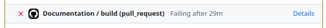

# Catalyst Developer Documentation

## [Release Process](@id devdocs_releaseprocess)
Beginning with v15, Catalyst is using a new release process to try to ensure
continuing stability of releases. Before making a release one should

1. Create a new release branch, i.e. "release-15.0.0".
2. On this branch, cap major dependencies to their latest version that works and
   for which tests pass.
   - Caps need to be included in both Project.toml and docs/Project.toml.
   - Do not cap the master branch as this can prevent upstream libraries from
     properly testing against Catalyst, and hide breaking changes that impact
     Catalyst.
3. [Check docs build](@ref devdocs_advice_doc_inspection) with the capped dependencies. 
   Visually verify via checking the artifact in the doc build that the docs actually
   look ok (since sometimes issues can arise that do not lead to actual errors in the doc CI).
5. Release via the [registration
   issue](https://github.com/SciML/Catalyst.jl/issues/127) with the
   command: `@JuliaRegistrator register branch=release-15.0.0`, modifying as appropriate
   for the version you are releasing.

If there is subsequently a need to increment the version of a dependency, this
should be done via a new release that follows the above process, and modifies
the [patch, minor, or major Catalyst version (as appropriate for the potential
impact of the dependency change on Catalyst users)](https://semver.org/). If the
dependency being updated is a non-breaking release, and would have automatically
been installed by the package resolver had it not been capped, a patch release
should be preferred. If the new release branch is branched from master, *it
needs to ensure Project.toml caps are all ≥ to those listed in the previous
Catalyst release branch*.

## [Development advice](@id devdocs_advice)

### [Checking doc builds for errors](@id devdocs_advice_doc_error_checks)
When updating documentation, Catalyst will run any Julia code provided within example blocks to dynamically create figures and outputs. In addition to automatically creating these for us, it also provides an automatic check that all code in documentation is correct. Here, if any of the documentation code throws an error, the build job will fail. The documentation build job can be found at the bottom of a PRs conversation, here is an example of a failed one:

To check what errors were produced, click on the "Details" link of the job. Next, any errors can be found at the bottom of the "Build and deploy" section (which should be opened automatically).

### [Inspecting the built documentation of a PR or branch](@id devdocs_advice_doc_inspection)
When updating documentation it is typically useful to view the updated documentation in HTML format (which is the format users will see). Here, some errors are much easier to spot in .html format as compared with the raw text files from which these are generated. There are two primary ways to view updated documentation, either by downloading them from the PR or by building the docs locally.

Whenever a PR to Catalyst is created, CI will create a corresponding documenter build job. If the build job passes, you can access the built documentation (which will be the new Catalyst documentation if the PR is merged) through the following steps:
1. Click on "Details" in the documentation build job (at the bottom of the PR conversation tab). 
2. Expand the "Upload site as artifact" section.
3. Click on the link at the end (which follows the "Artifact download URL: " text).
4. This will download a zip folder containing the documentation. Extract it to a location on your computer and then open the "index.html" file.

To build the Catalyst documentation locally:
1. Navigate to the ".julia/dev/Catalyst/docs/" folder, and run the "make.jl" file using ">julia --project=. make.jl". Alternatively, open a Julia session, activate the "docs" environment, and run the file using `include("make.jl").
2. Open the ".julia/dev/Catalyst/docs/build/index.html" file.

### [Spellchecking in your code](@id devdocs_advice_codespellchecker)
Especially when writing documentation, but also when writing normal code, it can be useful to have a spellchecker running through your texts. While code can be copied into a spellchecker and checked there (which is still useful to check grammar), it can also be very useful to (for users of VSCode) run the [Code Spell Checker](https://marketplace.visualstudio.com/items?itemName=streetsidesoftware.code-spell-checker) extension. This will automatically provide simple spell-checking for code and documentation as you write it.

## [Adding a new field to `ReactionSystem`](@id devdocs_new_field)

When adding a new field to the `ReactionSystem` struct, the following locations
must all be updated. Missing any of these can cause subtle bugs.

### Core struct and constructors
- **`reactionsystem_fields` constant** (`src/reactionsystem.jl`) — add the field
  name in the correct position.
- **Struct definition** (`src/reactionsystem.jl`) — add the field with docstring.
- **Inner constructor** (`src/reactionsystem.jl`) — add as positional argument and
  in the `new{...}(...)` call.
- **5-argument constructor** (`src/reactionsystem.jl`) — add as keyword argument
  with default, pass to inner constructor.
- **`make_ReactionSystem_internal`** (`src/reactionsystem.jl`) — add as keyword
  argument, pass through to 5-arg constructor.

### Composition and flattening
- **`flatten`** (`src/reactionsystem.jl`) — collect field from subsystems
  (recursively if needed) and pass to constructor.
- **`compose`** (`src/reactionsystem.jl`) — add keyword argument if the field
  should be settable at compose time; merge via `@set!`.
- **`extend`** (`src/reactionsystem.jl`) — union/merge field from both systems.

### Accessors
- **`get_*` accessor** (`src/reactionsystem.jl`) — top-level only (uses `getfield`).
- **Recursive accessor** (`src/reactionsystem.jl`) — collects from subsystems with
  namespacing (if applicable).
- **Exports** (`src/Catalyst.jl`) — export public accessors.

### Equality and serialization
- **`isequivalent`** (`src/reactionsystem.jl`) — add comparison for the field.
- **`save_reactionsystem`** (`src/reactionsystem_serialisation/serialise_reactionsystem.jl`)
  — add serialization support or an error guard if not yet supported.
- **`reactionsystem_uptodate_check`** — automatically covered by `reactionsystem_fields`.

### Conversion pipeline
- **`hybrid_model`** (`src/reactionsystem_conversions.jl`) — pass field through to
  `MT.System` constructor if applicable.
- **`ss_ode_model`** (`src/reactionsystem_conversions.jl`) — same (separate code path).
- **`sde_model` legacy path** (`src/reactionsystem_conversions.jl`) — same.
- **`eliminate_aliases`** (`src/alias_elimination.jl`) — substitute through the
  field if it contains symbolic expressions.

### DSL
- **`option_keys`** (`src/dsl.jl`) — add if the field has a DSL option.
- **`read_*_option`** (`src/dsl.jl`) — implement the option reader.
- **`make_reaction_system`** (`src/dsl.jl`) — wire into the generated code.

### Other
- **`system_to_reactionsystem`** (`src/reactionsystem_conversions.jl`) — handle in
  reverse conversion (or document as lost).
- **Tests** — add to appropriate test file.
- **HISTORY.md** — document for users.
