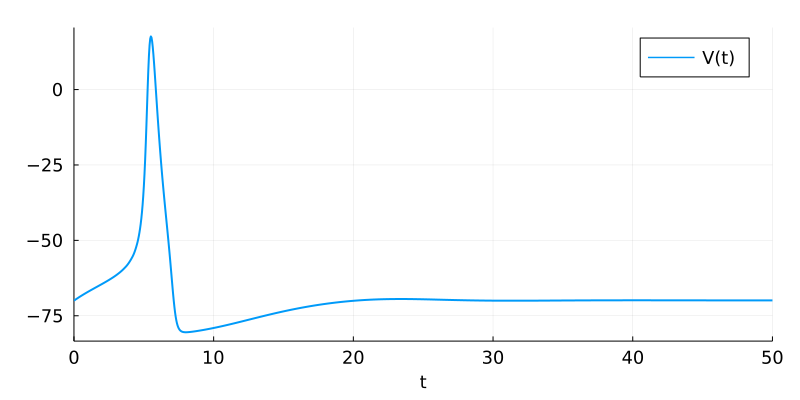

# [Hodgkin-Huxley Equation](@id hodgkin_huxley_equation)

This tutorial shows how to programmatically construct a [`ReactionSystem`](@ref) corresponding to the chemistry underlying the [Hodgkin–Huxley model](https://en.wikipedia.org/wiki/Hodgkin%E2%80%93Huxley_model) using [ModelingToolkit](http://docs.sciml.ai/ModelingToolkit/stable/)/[Catalyst](http://docs.sciml.ai/Catalyst/stable/).

The Hodgkin–Huxley model, or conductance-based model, is a mathematical model that describes how action potentials in neurons are initiated and propagated. It is a set of nonlinear differential equations that approximates the electrical characteristics of excitable cells such as neurons and muscle cells. It is a continuous-time dynamical system.

We begin by importing some necessary packages.
```julia
using ModelingToolkit, Catalyst, NonlinearSolve
using DifferentialEquations, IfElse
using Plots, GraphRecipes
```

Let's build a simple Hodgkin-Huxley model for a single neuron, with the voltage, V(t), included as a constraint ODESystem.

We first specify the transition rates for the three gating variables, $m(t)$, $n(t)$ and $h(t)$.

$$s' \xleftrightarrow[\beta_s(V(t))]{\alpha_s(V(t))} s, \quad s \in \{m,n,h\}$$

where $m$, $n$ and $h$, are gating variables that determine the fraction of active(open) or inactive ($m' = 1 - m, n' = 1 -n, h' = 1 - h$) receptors.

The transition rate functions, which depend on the voltage, $V(t)$, are then

```julia
begin 
	function αₘ(V) 
		theta = (V + 45) / 10
		IfElse.ifelse(theta == 0.0, 1.0, theta/(1 - exp(-theta)))
	end
	βₘ(V) = 4*exp(-(V + 70)/18)
	
	αₕ(V) = .07 * exp(-(V + 70)/20)
	βₕ(V) = 1/(1 + exp(-(V + 40)/10))
	
	function αₙ(V)
		theta = (V + 60) / 10
		IfElse.ifelse(theta == 0.0, .1, .1*theta / (1 - exp(-theta)))
	end
	βₙ(V) = .125 * exp(-(V + 70)/80)
end
```
Output:
```βₙ (generic function with 1 method)```


* We now declare the symbolic variable, `V(t)`, that will represent voltage.

* We tell Catalyst not to generate an equation for it from the reactions we list, using the `isbcspecies` metadata.

* This label tells Catalyst an ODE or nonlinear equation for `V(t)` will be provided in a constraint system.

Aside: `bcspecies` means a boundary condition species, a terminology from SBML.


```julia
@variables V(t) [isbcspecies=true]
```
Output:
`[V(t)]`


```julia
hhrn = @reaction_network hhmodel begin
	(αₙ($V),βₙ($V)), n′ <--> n
	(αₘ($V),βₘ($V)), m′ <--> m
	(αₕ($V),βₕ($V)), h′ <--> h
end
```

Output:

$hhrn =$

$$
\begin{align*}
\ce{ n^\prime &<=>[$\begin{cases}
0.1 & \text{if } \left( 6 + \frac{1}{10} V = 0.0 \right)\\\\\\
\frac{0.6000000000000001 + 0.010000000000000002 V}{1 - e^{-6 + \frac{-1}{10} V}} & \text{otherwise}
\end{cases}$][$0.125 e^{\frac{-7}{8} + \frac{-1}{80} V\left( t \right)}$] n}\\
\ce{ m^\prime &<=>[$\begin{cases}
1.0 & \text{if } \left( \frac{9}{2} + \frac{1}{10} V = 0.0 \right)\\\\\\
\frac{\frac{9}{2} + \frac{1}{10} V}{1 - e^{\frac{-9}{2} + \frac{-1}{10} V}} & \text{otherwise}
\end{cases}$][$4 e^{\frac{-35}{9} + \frac{-1}{18} V\left( t \right)}$] m}\\\\\\
\ce{ h^\prime &<=>[$0.07 e^{\frac{-7}{2} + \frac{-1}{20} V}$][$\frac{1}{1 + e^{-4 + \frac{-1}{10} V\left( t \right)}}$] h}
\end{align*}
$$


Next we create a `ModelingToolkit.ODESystem` to store the equation for `dV/dt`

```julia
voltageode = let
	@parameters C=1.0 ḡNa=120.0 ḡK=36.0 ḡL=.3 ENa=45.0 EK=-82.0 EL=-59.0 I₀=0.0
	@variables m(t) n(t) h(t)
	I = I₀ * sin(2*pi*t/30)^2 

	Dₜ = Differential(t)
	eqs = [Dₜ(V) ~ -1/C * (ḡK*n^4*(V-EK) + ḡNa*m^3*h*(V-ENa) + ḡL*(V-EL)) + I/C]
	@named voltageode = ODESystem(eqs, t)
end
```

Output:

$voltageode =$

$$
\begin{align}
\frac{dV(t)}{dt} =& \frac{ - {\textrm{\={g}}}L \left(  - EL + V\left( t \right) \right) - \left( n\left( t \right) \right)^{4} {\textrm{\={g}}}K \left(  - EK + V\left( t \right) \right) - \left( m\left( t \right) \right)^{3} {\textrm{\={g}}}Na \left(  - ENa + V\left( t \right) \right) h\left( t \right)}{C} + \frac{\sin^{2}\left( 0.20943951023931953 t \right) I_0}{C}
\end{align}
$$


Notice, we included an applied current, `I`, that we will use to perturb the system and create action potentials. For now we turn this off by setting its amplitude, `I₀`, to zero.

Finally, we couple this ODE into the reaction model as a constraint system:

```julia
@named hhmodel = extend(voltageode, hhrn);
```

* `hhmodel` is now a `ReactionSystem` that is coupled to an internal constraint `ODESystem` that stores `dV/dt`.

* Let's now solve to steady-state, as we can then use these resting values as an initial condition before applying a current to create an action potential.

```julia
hhsssol = let
	tspan = (0.0, 50.0)
	u₀ = [:V => -70, :m => 0.0, :h => 0.0, :n => 0.0, 
		  :m′ => 1.0, :n′ => 1.0, :h′ => 1.0]
	oprob = ODEProblem(hhmodel, u₀, tspan)
	sol = solve(oprob, Rosenbrock23())	
end;
```

```julia
plot(hhsssol, vars=V)
```
Output:<br/>


```julia
u_ss = hhsssol.u[end]
```


