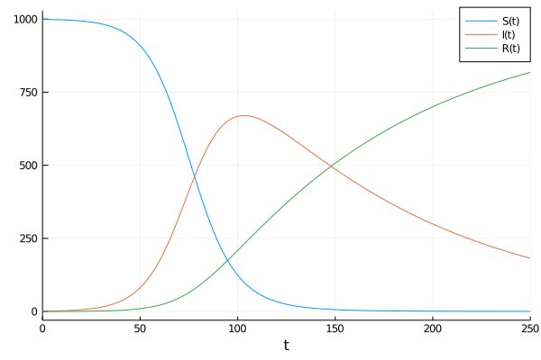

# Catalyst.jl for Reaction Models

Catalyst.jl is a symbolic modeling package for analysis and high performance
simulation of chemical reaction networks. Catalyst defines symbolic
[`ReactionSystem`](@ref)s, which can be created programmatically or easily
specified using Catalyst's domain specific language (DSL). Leveraging
[ModelingToolkit](https://github.com/SciML/ModelingToolkit.jl) and
[Symbolics.jl](https://github.com/JuliaSymbolics/Symbolics.jl), Catalyst enables
large-scale simulations through auto-vectorization and parallelism. Symbolic
`ReactionSystem`s can be used to generate ModelingToolkit-based models, allowing
the easy simulation and parameter estimation of mass action ODE models, Chemical
Langevin SDE models, stochastic chemical kinetics jump process models, and more.
Generated models can be used with solvers throughout the broader
[SciML](https://sciml.ai) ecosystem, including higher level SciML packages (e.g.
for sensitivity analysis, parameter estimation, machine learning applications,
etc).

## Features
- DSL provides a simple and readable format for manually specifying chemical
  reactions.
- Catalyst `ReactionSystem`s provide a symbolic representation of reaction networks,
  built on [ModelingToolkit.jl](https://github.com/SciML/ModelingToolkit.jl) and
  [Symbolics.jl](https://github.com/JuliaSymbolics/Symbolics.jl).
- Non-integer (e.g. `Float64`) stoichiometric coefficients are supported for generating
  ODE models, and symbolic expressions for stoichiometric coefficients are supported for
  all system types.
- The [Catalyst.jl API](@ref) provides functionality for extending networks,
  building networks programmatically, network analysis, and for composing multiple
  networks together.
- `ReactionSystem`s generated by the DSL can be converted to a variety of
  `ModelingToolkit.AbstractSystem`s, including symbolic ODE, SDE and jump process
  representations.
- Conservation laws can be detected and applied to reduce system sizes, and generate
  non-singular Jacobians, during conversion to ODEs, SDEs, and steady-state equations.
- By leveraging ModelingToolkit, users have a variety of options for generating
  optimized system representations to use in solvers. These include construction
  of dense or sparse Jacobians, multithreading or parallelization of generated
  derivative functions, automatic classification of reactions into optimized
  jump types for Gillespie type simulations, automatic construction of
  dependency graphs for jump systems, and more.
- Generated systems can be solved using any
  [DifferentialEquations.jl](https://github.com/SciML/DifferentialEquations.jl)
  ODE/SDE/jump solver, and can be used within `EnsembleProblem`s for carrying
  out parallelized parameter sweeps and statistical sampling. Plot recipes
  are available for visualizing the solutions.
- Julia `Expr`s can be obtained for all rate laws and functions determining the
  deterministic and stochastic terms within resulting ODE, SDE or jump models.
- [Latexify](https://github.com/korsbo/Latexify.jl) can be used to generate
  LaTeX expressions corresponding to generated mathematical models or the
  underlying set of reactions.
- [Graphviz](https://graphviz.org/) can be used to generate and visualize
  reaction network graphs. (Reusing the Graphviz interface created in
  [Catlab.jl](https://github.com/AlgebraicJulia/Catlab.jl/).)

## Packages Supporting Catalyst
- [MomentClosure.jl](https://github.com/augustinas1/MomentClosure.jl) allows
  generation of symbolic ModelingToolkit `ODESystem`s, representing moment
  closure approximations to moments of the Chemical Master Equation, from
  reaction networks defined in Catalyst.
- [FiniteStateProjection.jl](https://github.com/kaandocal/FiniteStateProjection.jl)
  allows the construction and numerical solution of Chemical Master Equation
  models from reaction networks defined in Catalyst.
- Catalyst [`ReactionSystem`](@ref)s can be imported from SBML files via
  [SBMLToolkit.jl](https://github.com/SciML/SBMLToolkit.jl), and from BioNetGen .net
  files and various stoichiometric matrix network representations using
  [ReactionNetworkImporters.jl](https://github.com/SciML/ReactionNetworkImporters.jl).

## Installation
Catalyst can be installed through the Julia package manager:

```julia
]add Catalyst
using Catalyst
```

## Illustrative Example
Here is a simple example of generating, visualizing and solving an SIR ODE
model. We first define the SIR reaction model using Catalyst
```julia
using Catalyst
rn = @reaction_network begin
    α, S + I --> 2I
    β, I --> R
end α β
```
Assuming [Graphviz](https://graphviz.org/) and is installed and *command line
accessible*, the network can be visualized using the [`Graph`](@ref) command
```julia
Graph(rn)
```
which in Jupyter notebooks will give the figure


To generate and solve a mass action ODE version of the model we use
```julia
using OrdinaryDiffEq
p     = [:α => .1/1000, :β => .01]
tspan = (0.0,250.0)
u0    = [:S => 999.0, :I => 1.0, :R => 0.0]
op    = ODEProblem(rn, u0, tspan, p)
sol   = solve(op, Tsit5())       # use Tsit5 ODE solver
```
which we can plot as
```julia
using Plots
plot(sol, lw=2)
```



## Getting Help
Catalyst developers are active on the [Julia
Discourse](https://discourse.julialang.org/), and the [Julia
Slack](https://julialang.slack.com) channels \#sciml-bridged and \#sciml-sysbio.
For bugs or feature requests [open an
issue](https://github.com/SciML/Catalyst.jl/issues).
