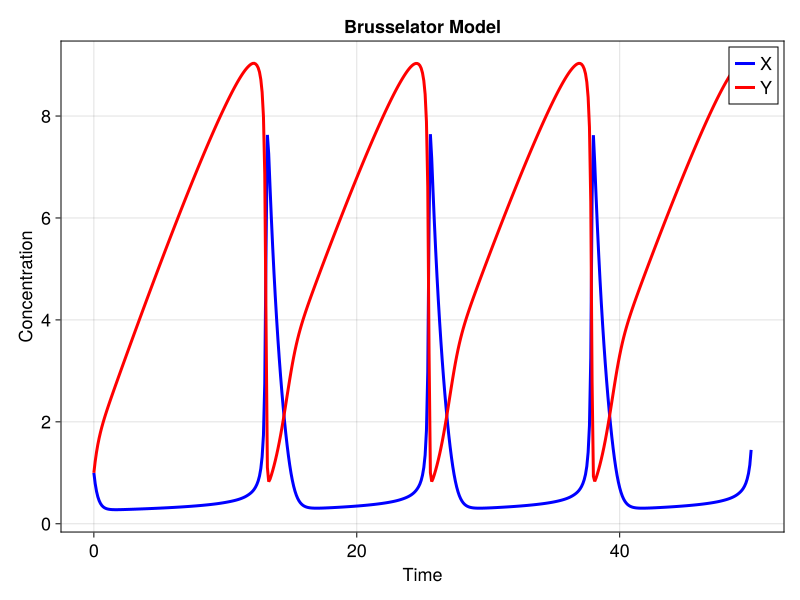
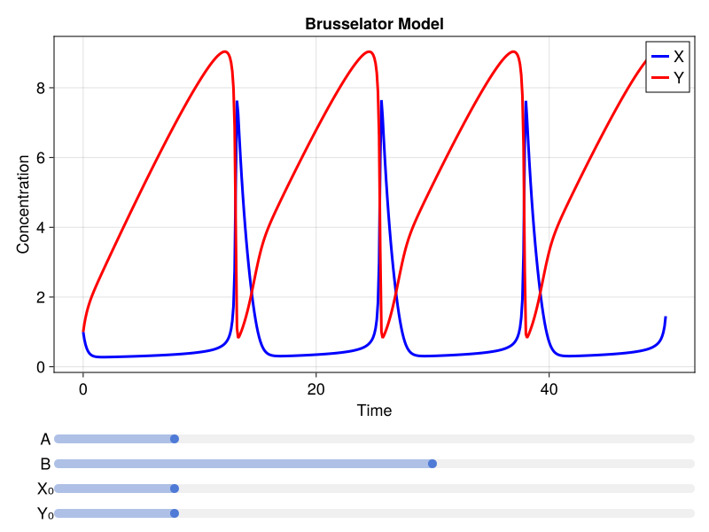

# [Interactive Simulation and Plotting](@id interactive_brusselator)

Catalyst can utilize the [GLMakie.jl](https://github.com/JuliaPlots/GLMakie.jl) package for creating interactive visualizations of your reaction network dynamics. This tutorial provides a step-by-step guide to creating an interactive visualization of the Brusselator model, building upon the basic [Brusselator](@ref basic_CRN_library_brusselator) example.


## [Setting up the Brusselator model](@id setup_brusselator)

Let's again use the oscillating Brusselator model, extending the basic simulation [plotting](@ref simulation_plotting) workflow we saw earlier.

```@example interactive_brusselator
using Catalyst
using OrdinaryDiffEq
using GLMakie; GLMakie.activate!(inline = true) # Activate the GLMakie backend. Here we set `inline = true` so that the plot is displayed inline for this documentation, but you can leave it out in your own work if you prefer plots displayed in a separate window.

# Define the Brusselator model
brusselator = @reaction_network begin
    A, ∅ → X
    1, 2X + Y → 3X
    B, X → Y
    1, X → ∅
end

# Initial parameter values and conditions
p = [:A => 1.0, :B => 4.0]
u0 = [:X => 1.0, :Y => 0.0]
tspan = (0.0, 50.0)

oprob = ODEProblem(brusselator, u0, tspan, p)

# Function to solve the ODE
function solve_brusselator(A, B, X0, Y0, prob = oprob)
    p = [:A => A, :B => B]
    u0 = [:X => X0, :Y => Y0]
    newprob = remake(prob, p=p, u0=u0)
    solve(newprob, Tsit5(), saveat = 0.1) 
end
```
This code sets up our Brusselator model using Catalyst.jl's `@reaction_network` macro. We also define initial parameters, initial conditions, create an `ODEProblem`, and define a function to solve the ODE with given parameters.  Setting `saveat = 0.1` in the call to `solve` ensures the solution is saved with the desired temporal frequency we want for our later plots.

!!! note
    Be sure to set `saveat` to a value that is appropriate for your system; otherwise, the size of the solution can change during interactivity, which will cause dimension mismatch errors once we add our interactive elements.

## [Basic static plotting](@id basic_static_plotting)

Let's start by creating a basic plot of our Brusselator model:

```@example interactive_brusselator
# Create the main figure
fig = Figure(size = (800, 600), fontsize = 18);

# Create an axis for the plot
ax = Axis(fig[1, 1], 
    title = "Brusselator Model", 
    xlabel = "Time", 
    ylabel = "Concentration")

# Solve the ODE
sol = solve_brusselator(1.0, 4.0, 1.0, 0.0)

# Plot the solution
lines!(ax, sol.t, sol[:X], label = "X", color = :blue, linewidth = 3)
lines!(ax, sol.t, sol[:Y], label = "Y", color = :red, linewidth = 3)

# Add a legend
axislegend(ax, position = :rt)

# Display the figure
fig
```

<!-- This will produce a basic time series plot of the Brusselator model:

 -->

The plot shows the concentrations of species X and Y over time. Notice the oscillatory behavior characteristic of the Brusselator model.

## [Adding interactivity](@id adding_interactivity)

Now, let's add interactivity to our plot using Observables and sliders. We'll build this up step by step.

### [Creating Observables](@id creating_observables)

Observables are a key concept in reactive programming and are central to how Makie.jl creates interactive visualizations. You can read more about them [here](https://docs.makie.org/stable/explanations/observables).

```@example interactive_brusselator
# Create observables for parameters and initial conditions
A = Observable(1.0)
B = Observable(4.0)
X0 = Observable(1.0)
Y0 = Observable(0.0)
```

An Observable is a container for a value that can change over time. When the value changes, any dependent computations are automatically updated.

### [Adding sliders and connecting to Observables](@id adding_sliders)

Let's add [sliders](https://docs.makie.org/stable/reference/blocks/slider) that will control our Observables:

```julia
# Create the main figure
fig = Figure(size = (800, 600), fontsize = 18);

# Create layout for plot and sliders
plot_layout = fig[1, 1] = GridLayout()
slider_layout = fig[2, 1] = GridLayout()

# Create sliders
slider_A = Slider(slider_layout[1, 1], range = 0.0:0.01:5.0, startvalue = to_value(A)) # to_value(A) unwraps the Observable to a value
slider_B = Slider(slider_layout[2, 1], range = 0.0:0.01:5.0, startvalue = to_value(B))
slider_X0 = Slider(slider_layout[3, 1], range = 0.0:0.01:5.0, startvalue = to_value(X0))
slider_Y0 = Slider(slider_layout[4, 1], range = 0.0:0.01:5.0, startvalue = to_value(Y0))

# Add labels for sliders
Label(slider_layout[1, 1, Left()], "A")
Label(slider_layout[2, 1, Left()], "B")
Label(slider_layout[3, 1, Left()], "X₀")
Label(slider_layout[4, 1, Left()], "Y₀")

# Connect the values of the sliders to the observables
connect!(A, slider_A.value)
connect!(B, slider_B.value)
connect!(X0, slider_X0.value)
connect!(Y0, slider_Y0.value)
```

These sliders allow us to interactively change the parameters A and B, as well as the initial conditions X₀ and Y₀.

### [Creating a reactive plot](@id reactive_plot)

Now, let's create a plot that reacts to changes in our sliders:

```@example interactive_brusselator
# Create an axis for the plot
ax = Axis(plot_layout[1, 1], 
    title = "Brusselator Model", 
    xlabel = "Time", 
    ylabel = "Concentration")

# Create an observable for the solution
# The `@lift` macro is used to create an Observable that depends on the observables `A`, `B`, `X0`, and `Y0`, and automatically updates when any of these observables change
solution = @lift(solve_brusselator($A, $B, $X0, $Y0))

# Plot the solution
# We don't use the ODESolution plot recipe here, as you've seen in the previous examples where only the solution and an `idxs` argument was passed to the plot method, because we are passing in an Observable wrapping the solution
lines!(ax, lift(sol -> sol.t, solution), lift(sol -> sol[:X], solution), label = "X", color = :blue, linewidth = 3) # `lift` can either be used as a function or a macro
lines!(ax, lift(sol -> sol.t, solution), lift(sol -> sol[:Y], solution), label = "Y", color = :red, linewidth = 3)

# Add a legend
axislegend(ax, position = :rt)

# Display the figure
fig
```
<!-- 
The resulting figure should look like this:

 -->

This plot will now update in real-time as you move the sliders, allowing for interactive exploration of the Brusselator's behavior under different conditions.

## [Adding a phase plot](@id adding_phase_plot)

To gain more insight into the system's behavior, let's enhance our visualization by adding a phase plot, along with some other improvements:

```@example interactive_brusselator
# Create the main figure
fig = Figure(size = (1200, 800), fontsize = 18);

# Create main layout: plots on top, sliders at bottom
plot_grid = fig[1, 1] = GridLayout()
slider_grid = fig[2, 1] = GridLayout()

# Create sub-grids for plots
time_plot = plot_grid[1, 1] = GridLayout()
phase_plot = plot_grid[1, 2] = GridLayout()

# Create axes for the time series plot and phase plot
ax_time = Axis(time_plot[1, 1], 
    title = "Brusselator Model - Time Series", 
    xlabel = "Time", 
    ylabel = "Concentration")

ax_phase = Axis(phase_plot[1, 1], 
    title = "Brusselator Model - Phase Plot", 
    xlabel = "X", 
    ylabel = "Y")

# Create sub-grids for sliders
param_grid = slider_grid[1, 1] = GridLayout()
ic_grid = slider_grid[1, 2] = GridLayout()

# Create observables for parameters and initial conditions
A = Observable{Float64}(1.0) # We can specify the type of the Observable value, which can help with type stability and performance
B = Observable{Float64}(4.0)
X0 = Observable{Float64}(1.0)
Y0 = Observable{Float64}(0.0)

# Create sliders with labels and group titles
Label(param_grid[1, 1:2], "Parameters", fontsize = 22)
slider_A = Slider(param_grid[2, 2], range = 0.0:0.01:5.0, startvalue = to_value(A))
slider_B = Slider(param_grid[3, 2], range = 0.0:0.01:5.0, startvalue = to_value(B))
Label(param_grid[2, 1], "A")
Label(param_grid[3, 1], "B")

Label(ic_grid[1, 1:2], "Initial Conditions", fontsize = 22)
slider_X0 = Slider(ic_grid[2, 2], range = 0.0:0.01:5.0, startvalue = to_value(X0))
slider_Y0 = Slider(ic_grid[3, 2], range = 0.0:0.01:5.0, startvalue = to_value(Y0))
Label(ic_grid[2, 1], "X₀")
Label(ic_grid[3, 1], "Y₀")

# Connect sliders to observables
connect!(A, slider_A.value)
connect!(B, slider_B.value)
connect!(X0, slider_X0.value)
connect!(Y0, slider_Y0.value)

# Create an observable for the solution. 
solution = @lift(solve_brusselator($A, $B, $X0, $Y0))

# Plot the time series
lines!(ax_time, lift(sol -> sol.t, solution), lift(sol -> sol[:X], solution), label = "X", color = :blue, linewidth = 3) 
lines!(ax_time, lift(sol -> sol.t, solution), lift(sol -> sol[:Y], solution), label = "Y", color = :red, linewidth = 3)

# Plot the phase plot
phase_plot_obj = lines!(ax_phase, lift(sol -> sol[:X], solution), lift(sol -> sol[:Y], solution), 
                        color = lift(sol -> sol.t, solution), colormap = :viridis)

# Add a colorbar for the phase plot
Colorbar(phase_plot[1, 2], phase_plot_obj, label = "Time")

# Add legends
axislegend(ax_time, position = :rt)

# Adjust layout to your liking
colgap!(plot_grid, 20)
rowgap!(fig.layout, 20)
colgap!(param_grid, 10)
colgap!(ic_grid, 10)

# Display the figure
fig
```

This will create a visualization with both time series and phase plots:


## [Common plotting options](@id common_makie_plotting_options)

Various plotting options can be provided as optional arguments to the `lines!` command. Common options include:
- `linewidth` or `lw`: Determine plot line widths.
- `linestyle`: Determines plot line style.
- `color`: Determines the line colors.
- `label`: Determines label texts displayed in the legend.

For example:

```julia
lines!(ax_time, lift(sol -> sol.t, solution), lift(sol -> sol[:X], solution), 
       label = "X", color = :green, linewidth = 2, linestyle = :dash)
```

## [Extending the interactive visualization](@id extending_interactive_visualization)

You can further extend this visualization by:
- Adding other interactive elements, such as [buttons](https://docs.makie.org/stable/reference/blocks/button) or [dropdown menus](https://docs.makie.org/stable/reference/blocks/menu) to control different aspects of the simulation or visualization.
- Adding additonal axes to the plot, such as plotting the derivatives of the species.
- Color coding the slider and slider labels to match the plot colors.


