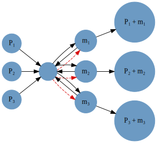

# [Network Analysis in Catalyst](@id network_analysis)

In this tutorial we introduce several of the Catalyst API functions for network
analysis. A complete summary of the exported functions is given in the API
section
[`Network-Analysis-and-Representations`](https://docs.sciml.ai/Catalyst/stable/api/catalyst_api/#Network-Analysis-and-Representations).

Note, currently API functions for network analysis and conservation law analysis
do not work with constant species (currently only generated by SBMLToolkit).

## [Network representation of the Repressilator `ReactionSystem`](@id network_analysis_repressilator_representation)
We first load Catalyst and construct our model of the repressilator
```@example s1
using Catalyst
repressilator = @reaction_network Repressilator begin
       hillr(P₃,α,K,n), ∅ --> m₁
       hillr(P₁,α,K,n), ∅ --> m₂
       hillr(P₂,α,K,n), ∅ --> m₃
       (δ,γ), m₁ <--> ∅
       (δ,γ), m₂ <--> ∅
       (δ,γ), m₃ <--> ∅
       β, m₁ --> m₁ + P₁
       β, m₂ --> m₂ + P₂
       β, m₃ --> m₃ + P₃
       μ, P₁ --> ∅
       μ, P₂ --> ∅
       μ, P₃ --> ∅
end
```
In the [Introduction to Catalyst](@ref introduction_to_catalyst)
tutorial we showed how the above network could be visualized as a
species-reaction graph. There, species are represented by the nodes of the graph
and edges show the reactions in which a given species is a substrate or product.
```julia
g = Graph(repressilator)
```


We also showed in the [Introduction to Catalyst](@ref introduction_to_catalyst) tutorial that
the reaction rate equation ODE model for the repressilator is
```math
\begin{aligned}
\frac{dm_1(t)}{dt} =& \frac{\alpha K^{n}}{K^{n} + \left( {P_3}\left( t \right) \right)^{n}} - \delta {m_1}\left( t \right) + \gamma \\
\frac{dm_2(t)}{dt} =& \frac{\alpha K^{n}}{K^{n} + \left( {P_1}\left( t \right) \right)^{n}} - \delta {m_2}\left( t \right) + \gamma \\
\frac{dm_3(t)}{dt} =& \frac{\alpha K^{n}}{K^{n} + \left( {P_2}\left( t \right) \right)^{n}} - \delta {m_3}\left( t \right) + \gamma \\
\frac{dP_1(t)}{dt} =& \beta {m_1}\left( t \right) - \mu {P_1}\left( t \right) \\
\frac{dP_2(t)}{dt} =& \beta {m_2}\left( t \right) - \mu {P_2}\left( t \right) \\
\frac{dP_3(t)}{dt} =& \beta {m_3}\left( t \right) - \mu {P_3}\left( t \right)
\end{aligned}
```

## [Matrix-vector reaction rate equation representation](@id network_analysis_matrix_vector_representation)
In general, reaction rate equation (RRE) ODE models for chemical reaction networks can
be represented as a first-order system of ODEs in a compact matrix-vector notation. Suppose
we have a reaction network with ``K`` reactions and ``M`` species, labelled by the state vector
```math
\mathbf{x}(t) = \begin{pmatrix} x_1(t) \\ \vdots \\ x_M(t)) \end{pmatrix}.
```
For the repressilator, ``\mathbf{x}(t)`` is just
```@example s1
x = species(repressilator)
```
The RRE ODEs satisfied by $\mathbf{x}(t)$ are then
```math
\frac{d\mathbf{x}}{dt} = N \mathbf{v}(\mathbf{x}(t),t),
```
where ``N`` is a constant ``M`` by ``K`` matrix with ``N_{m k}`` the net
stoichiometric coefficient of species ``m`` in reaction ``k``.
``\mathbf{v}(\mathbf{x}(t),t)`` is the rate law vector, with
``v_k(\mathbf{x}(t),t)`` the rate law for the ``k``th reaction. For example,
for the first reaction of the repressilator above, the rate law is
```math
v_1(\mathbf{x}(t),t) = \frac{\alpha K^{n}}{K^{n} + \left( P_3(t) \right)^{n}}.
```
We can calculate each of these in Catalyst via
```@example s1
N = netstoichmat(repressilator)
```
and by using the [`oderatelaw`](@ref) function
```@example s1
rxs = reactions(repressilator)
ν = oderatelaw.(rxs)
```
Note, as [`oderatelaw`](@ref) takes just one reaction as input we use
broadcasting to apply it to each element of `rxs`.

Let's check that this really gives the same ODEs as Catalyst. Here is what Catalyst
generates by converting to an `ODESystem`
```@example s1
osys = convert(ODESystem, repressilator)

# for display purposes we just pull out the right side of the equations
odes = [eq.rhs for eq in equations(osys)]
```
whereas our matrix-vector representation gives
```@example s1
odes2 = N * ν
```
Let's check these are equal symbolically
```@example s1
isequal(odes, odes2)
```

## [Reaction complex representation](@id network_analysis_reaction_complexes)
We now introduce a further decomposition of the RRE ODEs, which has been used to
facilitate analysis of a variety of reaction network properties. Consider a simple
reaction system like
```@example s1
rn = @reaction_network begin
 k*A, 2*A + 3*B --> A + 2*C + D
 b, C + D --> 2*A + 3*B
end
```
We can think of the first reaction as converting the *reaction complex*,
``2A+3B`` to the complex ``A+2C+D`` with rate ``kA``. Suppose we order our
species the same way as Catalyst does, i.e.
```math
\begin{pmatrix}
x_1(t)\\
x_2(t)\\
x_3(t)\\
x_4(t)
\end{pmatrix} =
\begin{pmatrix}
A(t)\\
B(t)\\
C(t)\\
D(t)
\end{pmatrix},
```
which should be the same as
```@example s1
species(rn)
```
We can describe a given reaction complex by the stoichiometric coefficients of
each species within the complex. For the reactions in `rn` these vectors would
be
```math
\begin{align*}
2A+3B = \begin{pmatrix}
2\\
3\\
0\\
0
\end{pmatrix}, &&
A+2C+D = \begin{pmatrix}
1\\
0\\
2\\
1
\end{pmatrix},
 &&
C+D = \begin{pmatrix}
0\\
0\\
1\\
1
\end{pmatrix}
\end{align*}
```
Catalyst can calculate these representations as the columns of the complex
stoichiometry matrix,
```@example s1
Z = complexstoichmat(rn)
```
If we have ``C`` complexes, ``Z`` is a ``M`` by ``C`` matrix with ``Z_{m c}``
giving the stoichiometric coefficient of species ``m`` within complex ``c``.

We can use this representation to provide another representation of the RRE
ODEs. The net stoichiometry matrix can be factored as ``N = Z B``, where ``B``
is called the incidence matrix of the reaction network,
```@example s1
B = incidencemat(rn)
```
Here ``B`` is a ``C`` by ``K`` matrix with ``B_{c k} = 1`` if complex ``c``
appears as a product of reaction ``k``, and ``B_{c k} = -1`` if complex ``c`` is a
substrate of reaction ``k``.

Using our decomposition of ``N``, the RRE ODEs become
```math
\frac{dx}{dt} = Z B \mathbf{v}(\mathbf{x}(t),t).
```
Let's verify that ``N = Z B``,
```@example s1
N = netstoichmat(rn)
N == Z*B
```

Reaction complexes give an alternative way to visualize a reaction network
graph. Catalyst's [`complexgraph`](@ref) command will calculate the complexes of
a network and then show how they are related. For example,
```julia
complexgraph(rn)
```
gives


while for the repressilator we find
```julia
complexgraph(repressilator)
```



Here ∅ represents the empty complex, black arrows show reactions converting
substrate complexes into product complexes where the rate is just a number or
parameter, and red arrows indicate the conversion of substrate complexes into
product complexes where the rate is an expression involving chemical species.

# Full decomposition of the reaction network ODEs (flux matrix and mass-action vector)
So far we have covered two equivalent descriptions of the chemical reaction network ODEs: 
```math
\begin{align}
\frac{d\mathbf{x}}{dt} &= N \mathbf{v}(\mathbf{x}(t),t) \\
&= Z B \mathbf{v}(\mathbf{x}(t),t)
\end{align}
```

In this section we discuss a further decomposition of the ODEs. Recall that the reaction rate vector $\mathbf{v}$, which is a vector of length $R$ whose elements are the rate expressions for each reaction. Its elements can be written as 
```math
\mathbf{v}_{y \rightarrow y'} = k_{y \rightarrow y'} \mathbf{x}^y,
```
where $\mathbf{x}^y = \prod_s x_s^{y_s}$, the mass-action product of the complex $y$, where $y$ is the substrate complex of the reaction $y \rightarrow y'$. We can define a new vector called the mass action vector $\Phi(\mathbf{x}(t))$, a vector of length $C$ whose elements are the mass action products of each complex: 
```@example s1
Φ = massactionvector(rn)
```

An important thing to note is this function assumes [combinatoric ratelaws](@introduction_to_catalyst_ratelaws), meaning that mass-action products will get rescaled by factorial factors. For instance, note that the mass-action product for the complex `2A + 3B` has a factor of 1/12, corresponding to 1/(2! 3!). This option can be turned off with `combinatoric_ratelaws = false`.

```@example s1
Φ_2 = massactionvector(rn; combinatoric_ratelaws = false)
```

Then the reaction rate vector $\mathbf{v}$ can be written as 
```math
\mathbf{v}(\mathbf{x}(t)) = K \Phi(\mathbf{x}(t))
```
where $K$ is an $R$-by-$C$ matrix called the flux matrix, where $K_{rc}$ is the rate constant of reaction $r$ if $c$ is the index of the substrate complex of reaction $r$, and 0 otherwise. In Catalyst, the API function for $K$ is `fluxmat`: 
```@example s1
K = fluxmat(rn)
```

Since we have that $\mathbf{v} = K\Phi$, we can rewrite the above decompositions as follows: 
```math
\frac{d\mathbf{x}}{dt} &= N \mathbf{v}(\mathbf{x}(t),t) \\
&= N K \Phi(\mathbf{x}(t),t) \\
&= Z B K \Phi(\mathbf{x}(t),t). 
```

The final matrix to discuss is the product of $A_k = BK$, which is a $C$-by-$C$ matrix that turns out to be exactly the negative of the [graph Laplacian](https://en.wikipedia.org/wiki/Laplacian_matrix) of the weighted graph whose nodes are reaction complexes and whose edges represent reactions, weighted by the rate constants. The API function for $A_k$ is the `laplacianmat`: 
```@example s1
A_k = incidencemat(rn)
```
We can check that 
```@example s1
A_k == B * K
```

In sum, we have that
```math
\frac{d\mathbf{x}}{dt} &= N \mathbf{v}(\mathbf{x}(t),t) \\
&= N K \Phi(\mathbf{x}(t),t) \\
&= Z B K \Phi(\mathbf{x}(t),t). 
&= Z A_k \Phi(\mathbf{x}(t),t). 
```

All three of the objects introduced in this section (the flux matrix, mass-action vector, Laplacian matrix) will return symbolic outputs by default, but can be made to return numerical outputs if values are specified. 
For example, `massactionvector` will return a numerical output if a set of species concentrations is supplied using a dictionary, tuple, or vector of Symbol-value pairs.
```@example s1
concmap = Dict([:A => 3., :B => 5., :C => 2.4, :D => 1.5])
massactionvector(rn, concmap)
```

`fluxmat` and `laplacianmat` will return numeric matrices if a set of rate constants and other aprameters are supplied the same way.
```@example s1
parammap = Dict([:k => 12., b => 8.])
fluxmat(rn, parammap)
```

```@example s1
laplacianmat(rn, parammap)
```

# Symbolic ODE functions
In some cases it might be useful to generate the function defining the system of ODEs as a symbolic Julia function that can be used for further analysis. This can be done using Symbolics' [`build_function`](https://docs.sciml.ai/Symbolics/stable/getting_started/#Building-Functions), which takes a symbolic expression and a set of desired arguments, and converts it into a Julia function taking those arguments.

Let's build the full symbolic function corresponding to our ODE system. `build_function` will return two expressions, one for a function that outputs a new vector for the result, and one for a function that modifies the input in-place. Either expression can then be evaluated to return a Julia function.
```@example s1
parammap = Dict([:k => 12., b => 8.])
K = fluxmat(rn, parammap)
odes = N * K * Φ
f_oop_expr, f_iip_expr = Symbolics.build_function(odes, species(rn))
ode_func = eval(f_oop_expr)

concvec = [3., 5., 2., 6.]
ode_func(concvec)
```
The generated `ode_func` now corresponds to the $f(\mathbf{x}(t))$ on the right-hand side of $\frac{d\mathbf{x}(t)}{dt} = f(\mathbf{x}(t))$. Given a vector of species concentrations $c$, `ode_func` will return the rate of change of each species. Steady state concentration vectors `c_ss` will satisfy `ode_func(c_ss) = zeros(length(species(rn)))`.

Above we have generated a numeric rate matrix to substitute the rate constants into the symbolic expressions. We could have used a symbolic rate matrix, but then we would need to define the parameters `k, b`, so that the function `ode_func` knows what `k` and `b` in its output refer to.
```@example s1
@parameters k b 
K = fluxmat(rn)
odes = N * K * Φ
f_oop_expr, f_iip_expr = Symbolics.build_function(odes, species(rn))
ode_func = eval(f_oop_expr)

concvec = [3., 5., 2., 6.]
ode_func(concvec)
```

Alternatively, if we use a symbolic rate matrix, we could define our function to take in both species concentrations and parameter values as arguments:
```@example s1
K = fluxmat(rn)
odes = N * K * Φ
f_oop_expr, f_iip_expr = Symbolics.build_function(odes, species(rn), parameters(rn))
ode_func = eval(f_oop_expr)

concvec = [3., 5., 2., 6]; rateconsts = [12., 4.]
ode_func(concvec, rateconsts)
```

Note also that `ode_func` can take any vector with the right dimension (i.e. the number of species), not just a vector of `Number`, so it can be used to build, e.g. a vector of polynomials in Nemo for commutative algebraic methods.

# API Section for matrices and vectors
We have that: 
- $N$ is the `netstoichmat`
- $Z$ is the `complexstoichmat`
- $B$ is the `incidencemat`
- $K$ is the `fluxmat`
- $A_k$ is the `laplacianmat`
- $\Phi$ is the `massactionvector`

```@docs
netstoichmat
complexstoichmat
incidencemat
fluxmat
laplacianmat
massactionvector
```

---
## References
[^1]: [Feinberg, M. *Foundations of Chemical Reaction Network Theory*, Applied Mathematical Sciences 202, Springer (2019).](https://link.springer.com/book/10.1007/978-3-030-03858-8?noAccess=true)
