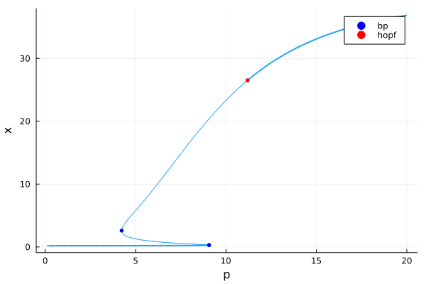

# Bifurcation Diagrams
Bifurcation diagrams can be produced from Catalyst generated models through the use of the [BifurcationKit.jl](https://github.com/rveltz/BifurcationKit.jl/) package. This tutorial gives a simple example of how to create such a bifurcation diagram. 

First, we declare our model. For our example we will use a bistable switch, but which also contains a Hopf bifurcation.
```@example ex1
using Catalyst
rn = @reaction_network begin
    (v0+v*(S*X)^n/((S*X)^n+(D*A)^n+K^n),d), ∅ ↔ X
    (τ*X,τ), ∅ ↔ A
end S D τ v0 v K n d
```
Next, BifurcationKit requires another form for the system function and Jacobian than what is used by the SciML ecosystem, so we need to declare these:
```@example ex1
odefun = ODEFunction(convert(ODESystem,rn),jac=true)
F = (u,p) -> odefun(u,p,0)      
J = (u,p) -> odefun.jac(u,p,0)
```
We also need to specify the system parameters for which we wish to plot the bifurcation diagram:
```@example ex1
params = [1.,9.,0.001,0.01,2.,20.,3,0.05]
```
Finally, we also need to set the input required to make the diagram. This is the index (in the parameter array) of the bifurcation parameter, the range over which we wish to plot the bifurcation diagram, as well as for which variable we wish to plot the steady state values in the diagram.
```@example ex1
p_idx = 1            # The index of the bifurcation parameter.
p_span = (0.1,20.)   # The parameter range for the bifurcation diagram.
plot_var_idx = 1     # The index of the variable we plot in the bifurcation diagram.
```

When creating a bifurcation diagram, we typically start in some point in parameter-phase space. For paramaeter space, we will simply select the beginning of the interval over which we wish to computer the bifurcation diagram. Here, we make a guess of an initial fixed point. While a good estimate could be provided through e.g. a simulation, the guess do not need to be very exact.
```@example ex1
params_bstart = setindex!(copy(params),p_span[1],p_idx)                               # The input parameter values have to start at the first index of our parameter span.
u0 = [1.0,1.0]
```
Next, we fetch the required packages to create the bifurcation diagram. We also  bundle the information we have compiled so far into a "`BifurcationProblem`".
```@example ex1
using BifurcationKit, Plots, LinearAlgebra, Setfield
bprob = BifurcationProblem(F, u0, params_bstart, (@lens _[p_idx]); recordFromSolution = (x, p) -> x[plot_var_idx], J=J)
```
Next, we need to specify the input options for the pseudo-arclength continuation method which produces the diagram..
```@example ex1
bopts = ContinuationPar( dsmax = 0.05,        # Maximum arclength value of the pseudo-arc length continuation method.
                        dsmin = 1e-4,        # Minimum arclength value of the pseudo-arc length continuation method.
                        ds=0.001,            # Initial arclength value of the pseudo-arc length continuation method (should be positive).
                        maxSteps = 100000,   # The maximum number of steps.
                        pMin = p_span[1],    # Minimum p-vale (if hit, the method stops).
                        pMax = p_span[2],    # Maximum p-vale (if hit, the method stops).
                        detectBifurcation=3) # Value in {0,1,2,3} determining to what extent bifurcation points are detected (0 means nothing is done, 3 both them and there localisation are detected).
```
With all this done, we can compute the bifurcation diagram:
```@example ex1
bf = bifurcationdiagram(bprob, PALC(), 2, (args...) -> bopts)
```
Finally, we can plot it:
```@example ex1
plot(bf)
```


Here, Hopf bifurcation is marked with a red dot and fold bifurcation with blue dots. The region with a thinner linewidth corresponds to unstable steady states. 

This tutorial demonstrates how to make a simple bifurcation diagram where all branches are connected. However, BifurcationKit.jl is a very powerful package capable of a lot more. For more details, please see that package's documentation: [BifurcationKit.jl](https://bifurcationkit.github.io/BifurcationKitDocs.jl/dev/). 

