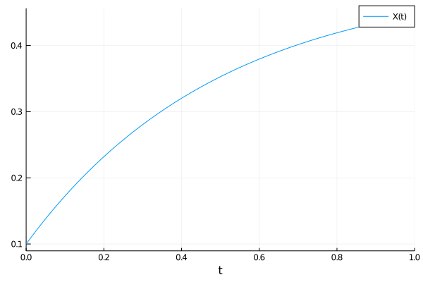

# Model Simulation
Once created, a reaction network can be used as input to various problem types
which can be solved by
[DifferentialEquations.jl](https://github.com/JuliaDiffEq/DifferentialEquations.jl/),
and more broadly used within [SciML](https://sciml.ai) packages.

#### Deterministic simulations using ODEs
A reaction network can be used as input to an `ODEProblem` instead of a
function, using 
```julia
odeprob = ODEProblem(rn, args...; kwargs...) 
``` 
E.g. a model can be created and solved using:
```julia
using DiffEqBase, OrdinaryDiffEq
rn = @reaction_network begin
  p, ∅ → X
  d, X → ∅
end p d
p = [1.0,2.0]
u0 = [0.1]
tspan = (0.,1.)
prob = ODEProblem(rn,u0,tspan,p)
sol = solve(prob, Tsit5())
```
Here the order of unknowns in `u0` and `p` matches the order that species and
parameters first appear within the DSL. They can also be determined by examining
the ordering within the [`species(rn)`](@ref) and [`params(rn)`](@ref) vectors,
or accessed more explicitly through the [`speciesmap(rn)`](@ref) and
[`paramsmap(rn)`](@ref) dictionaries, which map the ModelingToolkit `Variable`s
corresponding to each species or parameter to their integer id. Note, if no
parameters are given in the [`@reaction_network`](@ref) then `p` does not need
to be provided.

We can then plot the solution using the solution plotting receipe:
```julia
using Plots
plot(sol)
```


To solve for a steady-state starting from the guess `u0`, one can use
```julia
using SteadyStateDiffEq
prob = SteadyStateProblem(rn,u0,p)
sol = solve(prob, SSRootfind())
```
or
```julia
prob = SteadyStateProblem(rn,u0,p)
sol = solve(prob, DynamicSS(Tsit5()))
```

#### Stochastic simulations using SDEs
In a similar way an SDE can be created using 
```julia
using StochasticDiffEq
sdeprob = SDEProblem(rn, args...; kwargs...)
```
In this case the chemical Langevin equations (as derived in Gillespie, J. Chem.
Phys. 2000) will be used to generate stochastic differential equations.

#### Stochastic simulations using discrete stochastic simulation algorithms
Instead of solving SDEs one can create a stochastic jump process model using
integer copy numbers and a discrete stochastic simulation algorithm (i.e.
Gillespie Method or Kinetic Monte Carlo). This can be done using:
```julia
using DiffEqJump
rn = @reaction_network begin
  p, ∅ → X
  d, X → ∅
end p d
p = [1.0,2.0]
u0 = [10]
tspan = (0.,1.)
discrete_prob = DiscreteProblem(rn, u0, tspan, p)
jump_prob = JumpProblem(rn, discrete_prob, Direct())
sol = solve(jump_prob, SSAStepper())
```
Here we used Gillespie's `Direct` method as the underlying stochastic simulation
algorithm. We get
```julia
plot(sol)
```


#### Reaction rate laws used in simulations
In generating mathematical models from a [`ReactionSystem`](@ref), reaction
rates are treated as *microscopic* rates. That is, for a general mass action
reaction of the form $n_1 S_1 + n_2 S_2 + \dots n_M S_M \to \dots$ with
stoichiometric substrate coefficients $\{n_i\}_{i=1}^M$ and rate constant $k$,
the corresponding ODE rate law is taken to be
```math
k \prod_{i=1}^M \frac{(S_i)^{n_i}}{n_i!},
```
while the jump process transition rate (i.e. propensity function) is
```math
k \prod_{i=1}^M \frac{S_i (S_i-1) \dots (S_i-n_i+1)}{n_i!}.
```
For example, the ODE model of the reaction $2X + 3Y \to Z$ with rate constant $k$ would be
```math
\frac{dX}{dt} =  -2 k \frac{X^2}{2!} \frac{Y^3}{3!} = -k \frac{X^2 Y^3}{3!} \\
\frac{dY}{dt} =  -3 k \frac{X^2}{2!} \frac{Y^3}{3!} = -k \frac{X^2 Y^3}{4} \\
\frac{dZ}{dt} = k \frac{X^2}{2!} \frac{Y^3}{3!}.
```
